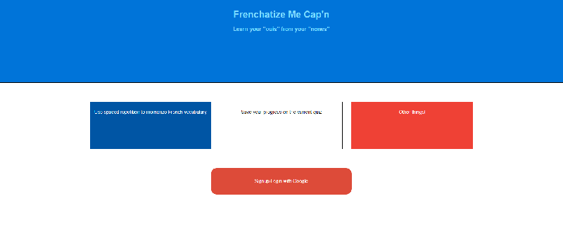
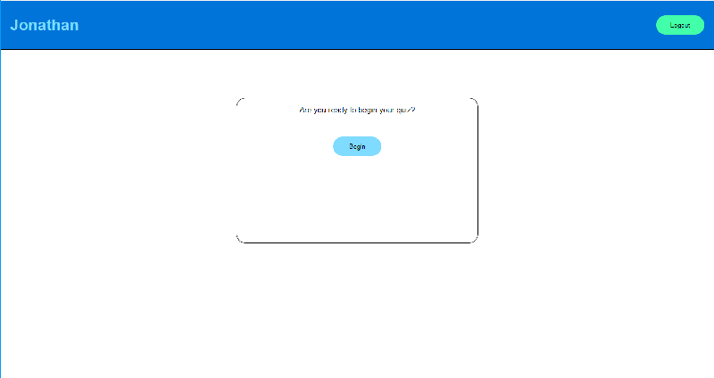
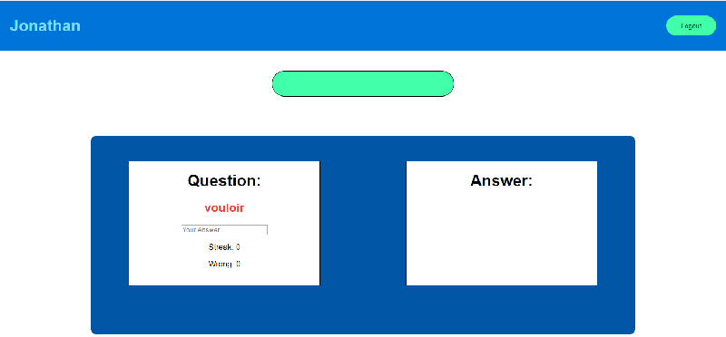
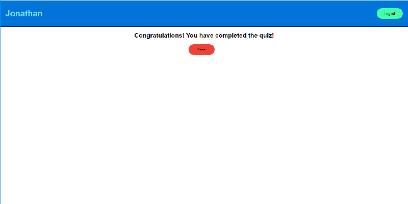

# MVP For Frenchatize Me Cap'n

A working MVP for a spaced repetition application. I helps your memorize 10 French vocabulary words. Find the demo
at http://frenchatize.herokuapp.com/

## Description
My spaced repetition app allows users to complete a quiz that help with memorization of French vocabulary.
It's an easy way for users to practice some basic French knowledge.

My MVP uses one set of ten questions as content, but can easily be expanded upon.

## How To Use

Registering and signing in is easy, just click the Register/sign-in button and you'll be prompted to sign-in using your
Google account.

You will then be asked if you want to begin the quiz. Upon clicking begin, you will be taken to the first question.

Users can input their answer for each French word and will see the answer along with feedback upon submission.

Users must complete each word 3 times in a row without getting the word wrong in order to complete the quiz.

If the user gets one wrong, it will appear again two questions later and their streak for the word will be broken.

If the user gets it right, their streak with the word will go up by one and the word will move to the end of the question queue. If the user gets a streak of 3 on a word, then the word will not reappear until the quiz is complete and reset.

If the user completes the quiz then they will be congratulated and the quiz will be reset.

The user is also allowed to save their progress for a later time. Simply log out and upon logging back in, users will
start right back where they left off.

## Screengrabs
Login screen:

Start Page:

Quiz Page:

Finish Page:

## The Stack

* **The Front End**
  * React
  * Redux
  * CSS
* **The Back End**
  * Node
  * Express
  * Mongo instance on mLab
  * Mongoose
  * OAuth
  * Passport

## Lessons Learned

* **Process, Planning, Development, Coordination**
  * Really plan what needs to be done first. Doing tasks out of order can make other tasks harder.
  * Decide on a proper data structure or you're going to have a bad time.
* **Development and Technology**
  * Pros:
    * React is fun to work with as always.
    * Redux makes is really easy to think about and manage state.
  * Cons:
    *
* **Next Steps**
  * Moving the logic for the spaced repetition to the back end.
  * Incorporate different quiz difficulty levels.
  * Add more quizzes to randomly draw from.
